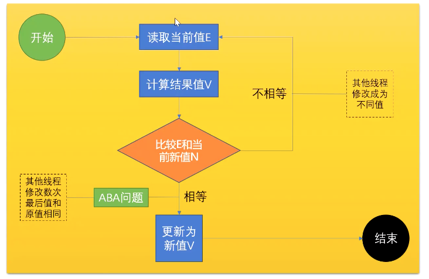

# 高并发

## synchronized 的底层实现

### CAS （compare and swap ,compare and exchange）

1. 轻量级的锁。又称之无锁和自旋锁。

2. 核心在于那个比较

### ABA问题

1. 描述：
    A线程：0->1

    此外：
    B线程：0->3
    C线程：3->0
  我们线程A在改动的过程中有两个线程也变动了该值。0->3->0 就是ABA问题。我们在往回写1的时候发现内存中的值依旧是0所以我们还是会写入。但是有些业务不允许出现 0->1中间
  出现被人改动而没有发现的情况。
2. 解决办法：加版本号、布尔类型值。

### 在不用synchronized下保证数据一致性 -- AtomicInteger

1. AtomicInteger.incrementAndGet() 底层就是采用CAS进行的。

2. 整个调用链：AtomicInteger.incrementAndGet() --> unsafe.getAndAddInt() --> public final **native** boolean AtomicInteger.compareAndSwapInt()
